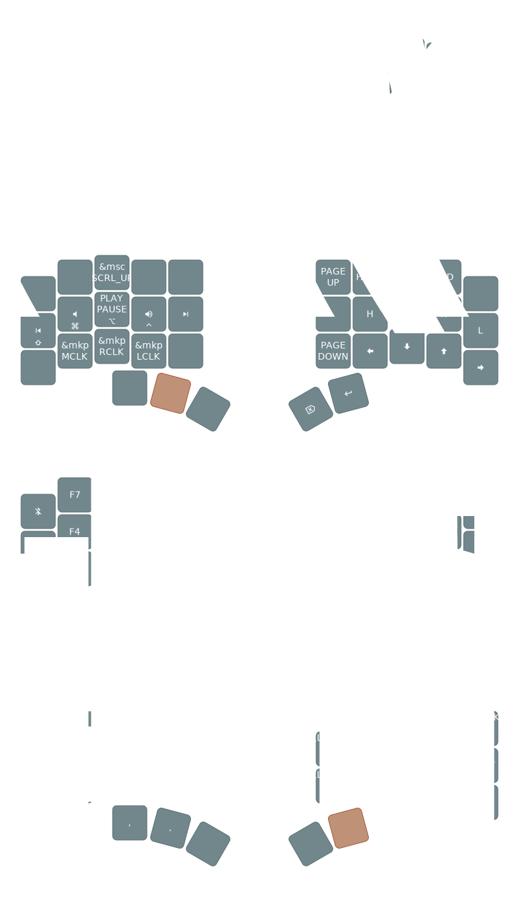

# ZMK Configuration

ZMK configuration for [charybdis nano](https://github.com/Bastardkb/Charybdis/tree/main) wireless
version with [nice!nano](https://nicekeyboards.com/nice-nano/).



## Building

This configuration uses a custom ZMK branch with pointer/scroll support and the PMW3610 trackball driver.

### Automated Build (GitHub Actions)

Firmware is automatically built on every push. Download the latest build from the [Actions tab](../../actions).

The build produces three firmware files:
- `charybdis_left-nice_nano_v2-zmk.uf2` - Left half firmware
- `charybdis_right-nice_nano_v2-zmk.uf2` - Right half firmware
- `settings_reset-nice_nano_v2-zmk.uf2` - Settings reset (use if you have pairing issues)

### Local Build

#### Prerequisites

Install dependencies:
```bash
# Install west and dependencies
pip3 install --user -U west
```

#### Build Steps

```bash
# Initialize west workspace
west init -l config/
west update

# Build firmware
west build -s zmk/app -b nice_nano_v2 -- -DSHIELD=charybdis_left -DZMK_CONFIG="$(pwd)/config"
west build -s zmk/app -b nice_nano_v2 -- -DSHIELD=charybdis_right -DZMK_CONFIG="$(pwd)/config"
```

Firmware files will be in `build/zephyr/zmk.uf2`.

## Flashing

1. Put the nice!nano into bootloader mode:
   - Double-tap the reset button on the nice!nano
   - A USB drive should appear named `NICENANO`

2. Copy the appropriate `.uf2` file to the drive:
   - For left half: copy `charybdis_left-nice_nano_v2-zmk.uf2`
   - For right half: copy `charybdis_right-nice_nano_v2-zmk.uf2`

3. The drive will automatically disconnect once flashing is complete

4. Repeat for the other half

**Note:** Flash both halves when updating firmware to ensure they stay in sync.

## Bluetooth Pairing

### Initial Pairing

The keyboard will automatically enter pairing mode on first boot. Simply search for Bluetooth devices on your computer and connect to the keyboard.

### Reconnecting/Switching Devices

ZMK supports multiple Bluetooth profiles (up to 5 devices). To manage connections:

1. Access the NUFU layer (hold the left thumb key where TAB is)
2. The top-left key (`BT_CLR_ALL`) clears all Bluetooth bonds - use this if you have pairing issues
3. After clearing, the keyboard will re-enter pairing mode automatically

### Troubleshooting Bluetooth Issues

If you experience connection problems:

1. **Clear bonds on the keyboard**: Use `BT_CLR_ALL` on the NUFU layer (top-left position)
2. **Remove/forget the device** on your computer's Bluetooth settings
3. **Flash settings reset firmware** (if issues persist):
   - Flash `settings_reset-nice_nano_v2-zmk.uf2` to both halves
   - Then re-flash the normal firmware
4. **Re-pair** the keyboard with your computer

## Features

- Colemak-DH Swedish layout
- Home row mods with balanced flavor
- Mouse/trackball integration with PMW3610 sensor
- **Scroll mode**: Hold left click button + move trackball to scroll
- Media controls and navigation on MEDNAV layer
- Symbol and numpad layers
